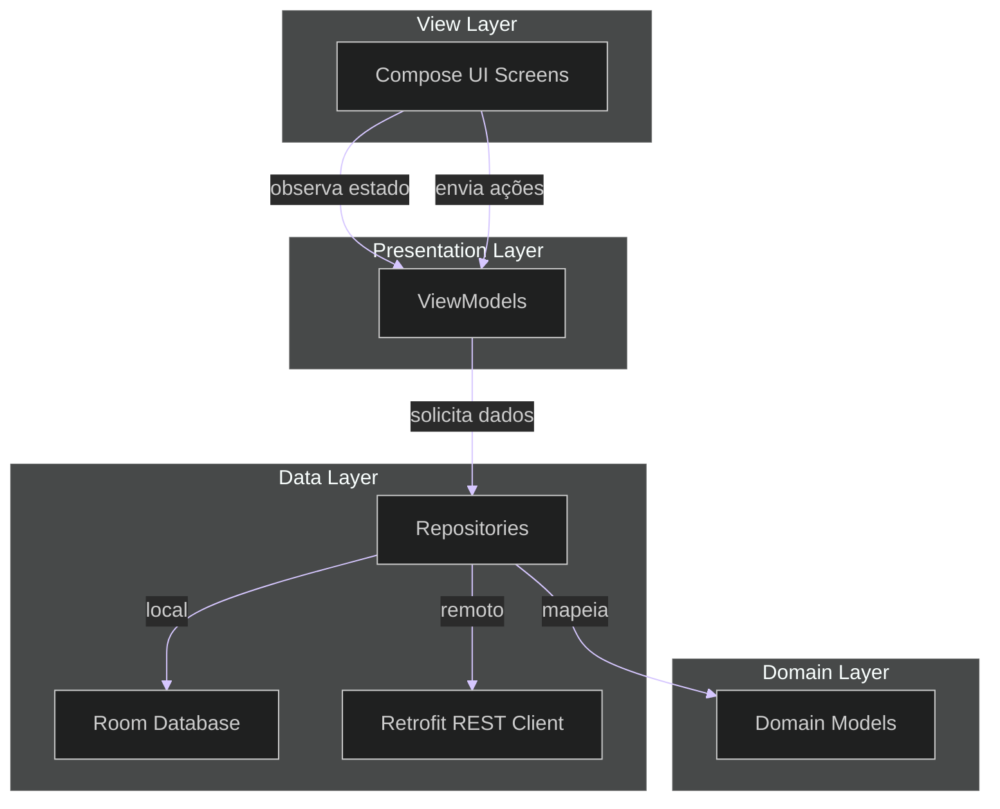

# Meus Afazeres 📝
> Um gerenciador de afazeres visual e intuitivo no estilo quadro de post-its com suporte local (offline) e remoto (nuvem).

---

<p align="center">
  
  
  
  
  
  
  
</p>

---

## 🎓 Contexto Acadêmico
Este aplicativo foi desenvolvido como projeto para a disciplina de **Programação de Dispositivos Móveis (PDM)** no **Instituto Federal de Educação, Ciência e Tecnologia da Paraíba (IFPB)**.

* **Professor:** Edemberg Rocha
* **Desenvolvedores Responsáveis:**
  * **Caue Trajano** — Matrícula: `20231370016`
  * **Douglas Carneiro** — Matrícula: `20231370002`

---

## 💡 Descrição da Solução
Muitas pessoas organizam suas tarefas colando pequenos blocos de papel colorido (post-its) em painéis ou quadros brancos. **Meus Afazeres** emula esse comportamento físico em uma interface digital elegante de aplicativo móvel Android. 

### Principais Características Visuais e Funcionais:
1. **Cards Coloridos por Prioridade (RF10):** As tarefas são exibidas em post-its virtuais cujas cores facilitam a identificação visual rápida de urgência:
   * 🔴 **Vermelho** para prioridade **Alta** (Color: `#FFFFCDD2`).
   * 🟠 **Laranja** para prioridade **Média** (Color: `#xFFFFE0B2`).
   * 🟡 **Amarelo** para prioridade **Leve** (Color: `#xFFFFF9C4`).
   * ⚪ **Branco** para prioridade **Normal** (`Color.White`).
2. **Efeito Visual de Papel Amassado:** Ao marcar um afazer como concluído (`FEITO`) diretamente no card via toggle switch, um filtro visual de papel amassado e riscado é aplicado sobre o post-it, sinalizando que a atividade foi cumprida de forma muito satisfatória.
3. **Modos de Uso Híbridos:**
   * **Modo Anônimo / Offline:** O app inicia sem necessidade de cadastro, gravando os dados diretamente no banco de dados local **Room**.
   * **Modo Sincronizado / Nuvem:** Caso o usuário opte por realizar cadastro e login com e-mail/senha, suas tarefas passam a ser sincronizadas em tempo real com o banco de dados na nuvem **Cloud Firestore**, garantindo persistência e acesso multi-dispositivo.

---

## 📋 Requisitos Funcionais e Implementação

Abaixo estão listados os requisitos funcionais planejados e como foram efetivamente implementados no código-fonte do aplicativo:

| Requisito | Descrição Planejada | Detalhe de Implementação |
| :--- | :--- | :--- |
| **RF1** | Criar nova tarefa com título, descrição, prioridade e prazo. | Uso de campos de texto e do componente nativo `DatePickerDialog` em [CadastroTaskScreen.kt](app/src/main/java/com/example/meusafazeres/ui/screens/CadastroTaskScreen.kt). |
| **RF2** | Alterar uma tarefa existente. | Carregamento prévio dos dados do afazer em [CadastroTaskScreen.kt](app/src/main/java/com/example/meusafazeres/ui/screens/CadastroTaskScreen.kt) permitindo a edição e salvamento. |
| **RF3** | Excluir uma tarefa existente. | Execução de exclusão lógica usando a flag `removido = true` no Room local e via requisição REST PATCH no Firestore. |
| **RF4** | Marcar/desmarcar tarefa como feita utilizando um toggle. | Switch customizado no [TaskCard.kt](app/src/main/java/com/example/meusafazeres/ui/components/TaskCard.kt) que aplica um efeito de papel amassado visual sobre o card. |
| **RF5** | Buscar tarefas utilizando uma barra de busca. | Barra de pesquisa reativa em [MainScreen.kt](app/src/main/java/com/example/meusafazeres/ui/screens/MainScreen.kt) que filtra as tarefas instantaneamente conforme a digitação. |
| **RF6** | Filtrar tarefas por status (feito e não feito). | Filtros de status ("Pendente" e "Feito") estruturados no diálogo interativo (`AlertDialog`) em [MainScreen.kt](app/src/main/java/com/example/meusafazeres/ui/screens/MainScreen.kt). |
| **RF7** | Filtrar tarefas por prioridade. | Filtros de prioridades integrados no mesmo diálogo de seleção múltipla em [MainScreen.kt](app/src/main/java/com/example/meusafazeres/ui/screens/MainScreen.kt). |
| **RF8** | Cadastro de usuário no sistema. | Tela [RegisterScreen.kt](app/src/main/java/com/example/meusafazeres/ui/screens/RegisterScreen.kt) integrada com e-mail, senha e nome do usuário, registrando no Firebase Auth e Firestore. |
| **RF9** | Login de usuário no sistema. | Autenticação por e-mail/senha com mapeamento de erros e persistência de sessão em [LoginScreen.kt](app/src/main/java/com/example/meusafazeres/ui/screens/LoginScreen.kt). |
| **RF10** | Cores de cards diferenciadas por prioridade. | Cores em tons pastel aplicadas no [TaskCard.kt](app/src/main/java/com/example/meusafazeres/ui/components/TaskCard.kt) (Vermelho para Alta, Laranja para Média, Amarelo para Leve e Branco para Normal). |
| **RF11** | Ordenação de tarefas. | Ordenação cronológica decrescente automática (`dataCriacao DESC`) definida nos repositórios para exibir as tarefas mais recentes primeiro. |
| **RF12** | Exibir tarefas na tela principal com paginação. | Paginação dinâmica em lotes de 10 itens em [MainScreen.kt](app/src/main/java/com/example/meusafazeres/ui/screens/MainScreen.kt) acionada conforme a rolagem do scroll chega ao fim. |

---

## 🏗️ Arquitetura do Projeto (MVVM)
O aplicativo adota estritamente a arquitetura de mercado **MVVM (Model-View-ViewModel)** com fluxo unidirecional de dados:



### Divisão de Responsabilidades:
* **Model (Modelo):** Representado pelas classes de domínio puras [Task.kt](app/src/main/java/com/example/meusafazeres/model/Task.kt) e [User.kt](app/src/main/java/com/example/meusafazeres/model/User.kt), além de estruturas específicas de persistência como [TaskEntity.kt](app/src/main/java/com/example/meusafazeres/data/local/TaskEntity.kt) (Room) e [FirestoreDto.kt](app/src/main/java/com/example/meusafazeres/network/firestore/FirestoreDto.kt) (DTOs de transporte).
* **View (Visualização):** Telas declarativas escritas em Jetpack Compose que reagem a estados emitidos pelos ViewModels e notificam cliques/ações do usuário.
* **ViewModel (Visão-Modelo):** Gerencia o estado de interface (UI State) e dispara rotinas assíncronas usando Corrotinas do Kotlin (`viewModelScope`), isolando a interface da lógica de repositório e de rede.
* **Repository (Repositório):** Atua como o ponto de decisão e abstração de dados (Single Source of Truth). Ele decide se carrega/grava dados no banco de dados local ou na nuvem baseado no estado de autenticação do usuário.

---

## 🛠️ Tecnologias de Destaque

### 1. Koin (Injeção de Dependência)
Para evitar o acoplamento rígido das classes, facilitar a realização de testes unitários e gerenciar centralizadamente o ciclo de vida dos componentes, o Koin foi adotado como o framework de injeção de dependências do aplicativo. Ele é configurado no arquivo [appModule.kt](app/src/main/java/com/example/meusafazeres/di/appModule.kt) e inicializado na inicialização global do aplicativo em [MyApplication.kt](app/src/main/java/com/example/meusafazeres/MyApplication.kt). Através dele, instâncias singleton como DAOs do Room e repositórios (tais como [TaskRepository](app/src/main/java/com/example/meusafazeres/repository/TaskRepository.kt), [AuthRepository](app/src/main/java/com/example/meusafazeres/repository/AuthRepository.kt) e [UserRepository](app/src/main/java/com/example/meusafazeres/repository/UserRepository.kt)) são declaradas e injetadas de forma limpa e automática nas ViewModels do Jetpack Compose, as quais são requisitadas nas telas em [NavServiceLogin.kt](app/src/main/java/com/example/meusafazeres/ui/navigation/NavServiceLogin.kt) por meio da função `koinViewModel()`.

### 2. Room (Persistência Local)
Como biblioteca recomendada para abstrair o SQLite no Android, o Room é encarregado de estruturar e salvar os afazeres no armazenamento local do dispositivo do usuário. A arquitetura do banco é declarada em [AppDatabase.kt](app/src/main/java/com/example/meusafazeres/data/local/AppDatabase.kt), definindo as tabelas por meio de [TaskEntity.kt](app/src/main/java/com/example/meusafazeres/data/local/TaskEntity.kt) e descrevendo as consultas locais e inserções em [TaskDao.kt](app/src/main/java/com/example/meusafazeres/data/local/TaskDao.kt). As operações locais ocorrem quando o usuário executa o aplicativo em modo offline ou anônimo, no qual o [TaskRepository](app/src/main/java/com/example/meusafazeres/repository/TaskRepository.kt) intercepta as ações e as direciona ao DAO local, servindo-se do mapeador [TaskMapper.kt](app/src/main/java/com/example/meusafazeres/data/local/TaskMapper.kt) para converter as entidades locais de volta para o modelo de domínio do Kotlin.

### 3. Retrofit (Comunicação de Rede REST)
Para interagir com o ecossistema do Firebase na nuvem sem inflar o aplicativo com SDKs proprietários pesados, o Retrofit foi selecionado para realizar requisições HTTP declarativas diretamente contra a API REST oficial do Cloud Firestore. O cliente de rede é centralizado em [RetrofitClient.kt](app/src/main/java/com/example/meusafazeres/network/RetrofitClient.kt), onde um interceptor HTTP extrai o ID Token JWT do usuário logado via Firebase Auth de forma segura com `runBlocking` e o injeta como cabeçalho `Authorization: Bearer <token>` em todas as requisições de rede. Os mapeamentos das chamadas CRUD e estruturadas na rede são declarados nas interfaces [TaskApi.kt](app/src/main/java/com/example/meusafazeres/network/TaskApi.kt) e [UserApi.kt](app/src/main/java/com/example/meusafazeres/network/UserApi.kt), sendo serializados e deserializados utilizando o conversor padrão Gson.

### 4. Cloud Firestore (Sincronização em Nuvem)
O Cloud Firestore atua como o banco de dados em nuvem NoSQL encarregado de guardar e sincronizar os afazeres de usuários logados em tempo real de forma persistente. As requisições são consumidas por meio dos repositórios [TaskRepository](app/src/main/java/com/example/meusafazeres/repository/TaskRepository.kt) e [UserRepository](app/src/main/java/com/example/meusafazeres/repository/UserRepository.kt) que se comunicam com as rotas REST do Firestore. Para se adequar à tipagem estruturada estrita exigida pelo Firestore REST, criamos classes DTO específicas em [FirestoreDto.kt](app/src/main/java/com/example/meusafazeres/network/firestore/FirestoreDto.kt) (as quais encapsulam cada propriedade em classes como `StringField` ou `BooleanField`). São enviadas consultas estruturadas (`StructuredQuery`) via requisições POST para filtragem e ordenação complexas remotamente, além do uso de requisições parciais PATCH limitadas por máscaras de propriedades (`updateMask.fieldPaths`) para realizar atualizações parciais eficientes (como a alteração da propriedade `removido` durante a exclusão lógica de uma tarefa).

### 5. UI State (Gerenciamento de Estados Reativos)
O Jetpack Compose reconstrói as telas reativamente com base em estados observáveis, e para garantir a previsibilidade e evitar inconsistências visuais ou de sincronia de dados, estruturamos os fluxos do Compose utilizando a abordagem de UI State. Nas ViewModels [TaskViewModel.kt](app/src/main/java/com/example/meusafazeres/ui/viewmodel/TaskViewModel.kt) e [AuthViewModel.kt](app/src/main/java/com/example/meusafazeres/ui/viewmodel/AuthViewModel.kt), mantemos fluxos privados e expomos fluxos de leitura reativa `StateFlow` que encapsulam classes seladas (`sealed class`), representando os estados de fluxo do sistema (`Idle`, `Loading`, `Success` e `Error`). As telas em Compose coletam esse fluxo de forma assíncrona utilizando `.collectAsState()` e redesenham a interface instantaneamente (exibindo indicadores circulares em estados de carregamento, populando a lista em caso de sucesso ou notificando mensagens de erro).

---

## 📱 Telas do Aplicativo

### 1. Tela do Painel Principal ([MainScreen.kt](app/src/main/java/com/example/meusafazeres/ui/screens/MainScreen.kt))
* **Objetivo:** Funciona como o whiteboard do usuário.
* **Elementos da Tela:**
  * **Cabeçalho:** Identifica o usuário autenticado por e-mail ou nome (se logado), com botão para contrair/expandir a barra de buscas.
  * **Campo de Busca Dinâmico:** Um campo de texto que escuta mudanças e filtra tarefas instantaneamente pelo título ou descrição em tempo real.
  * **Botão de Filtro:** Dispara uma caixa de diálogo (`AlertDialog`) contendo filtros cruzados de seleção múltipla (por prioridades e por status do afazer), permitindo buscas cirúrgicas na base de dados.
  * **Listagem de Afazeres:** Renderiza um `LazyColumn` populado pelos cartões. Implementa a **Paginação de Itens (RF12)**, detectando quando o usuário rola o scroll ao limite inferior e disparando uma requisição de novas tarefas (lote de 10 em 10 itens no Firestore) de forma transparente.

### 2. Tela de Cadastro/Edição de Tarefas ([CadastroTaskScreen.kt](app/src/main/java/com/example/meusafazeres/ui/screens/CadastroTaskScreen.kt))
* **Objetivo:** Adicionar novas tarefas ou editar os campos de uma já existente.
* **Elementos da Tela:**
  * **Campos de Texto:** Título da tarefa e descrição detalhada.
  * **Menu Suspenso (Dropdown):** Caixa de seleção de prioridades (Alta, Média, Leve, Normal).
  * **Seletor de Datas Integrado:** Clicando no campo de data, o aplicativo invoca o calendário nativo do sistema (`DatePickerDialog`), formatando o prazo de forma amigável no padrão brasileiro `dd/MM/yyyy`.
  * **Botão Salvar / Atualizar:** Adiciona o item à lista ou persiste as alterações parciais nas bases de dados correspondentes.

### 3. Tela de Login ([LoginScreen.kt](app/src/main/java/com/example/meusafazeres/ui/screens/LoginScreen.kt))
* **Objetivo:** Realizar a autenticação do usuário com credenciais do Firebase.
* **Elementos da Tela:**
  * Logo exclusiva da aplicação.
  * Campos de e-mail e senha com validações visuais nativas de erro.
  * Links diretos de navegação para a tela de registro de novos usuários.
  * Tratamento e mapeamento amigável de exceções de autenticação retornados pela nuvem.

### 4. Tela de Registro ([RegisterScreen.kt](app/src/main/java/com/example/meusafazeres/ui/screens/RegisterScreen.kt))
* **Objetivo:** Cadastrar novos usuários.
* **Elementos da Tela:**
  * Campos de Nome Completo, E-mail, Senha e Confirmação de Senha.
  * Validações locais rigorosas (campos vazios, divergência entre campos de senha).
  * Gravação imediata do usuário na base Firebase Auth e criação correspondente do registro de perfil na coleção `/users` do Firestore Cloud REST API.

---

## ⚡ Como Executar o Aplicativo

### Pré-requisitos
* Android Studio Jellyfish (ou mais recente).
* Gradle 8.0+.
* JDK 17.

### Passos para a Execução:
1. Clone o repositório em sua máquina local:
   ```bash
   git clone https://github.com/CaueTrajanoG/MeusAfazeresMobile.git
   ```
2. Crie ou conecte um projeto no Console do Firebase.
3. Baixe o arquivo de configuração `google-services.json` gerado pelo console.
4. Mova o arquivo `google-services.json` para dentro do diretório `/app` do projeto clonado.
5. Abra o projeto no Android Studio.
6. Aguarde a sincronização inicial das dependências via Gradle.
7. Compile e execute o aplicativo em um emulador ou em um dispositivo móvel físico conectado.
